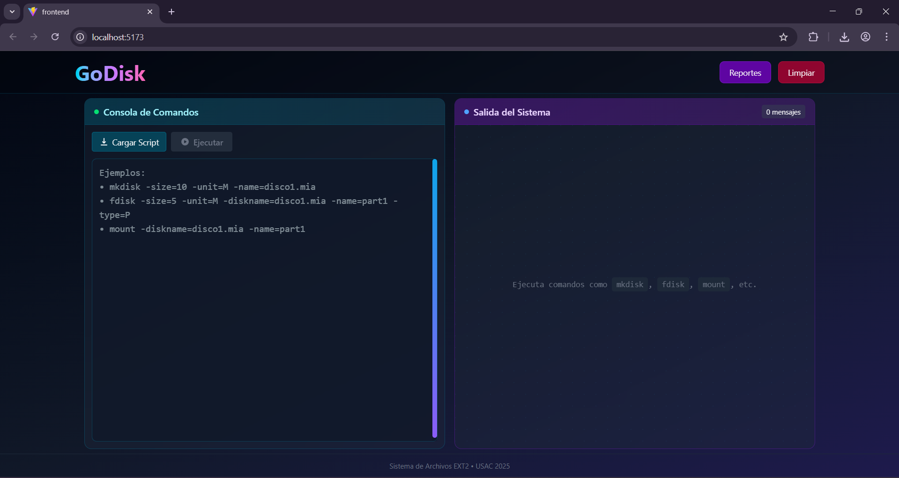
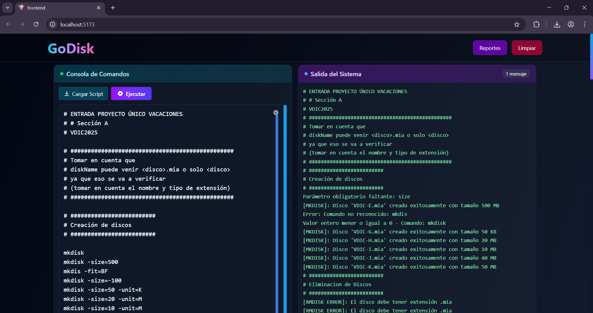
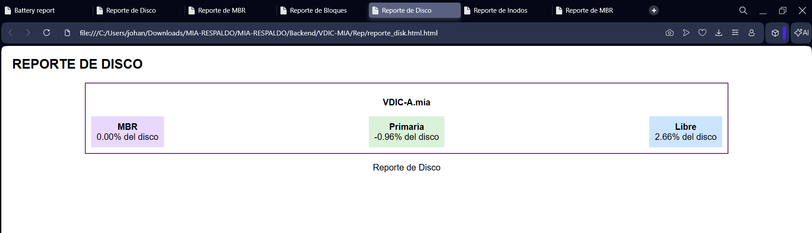
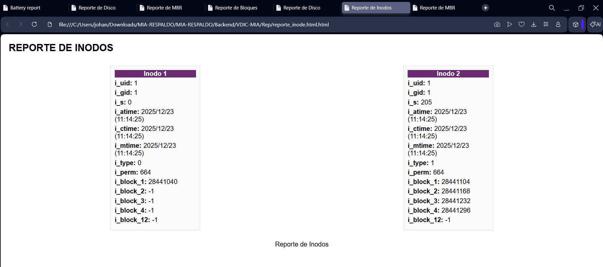
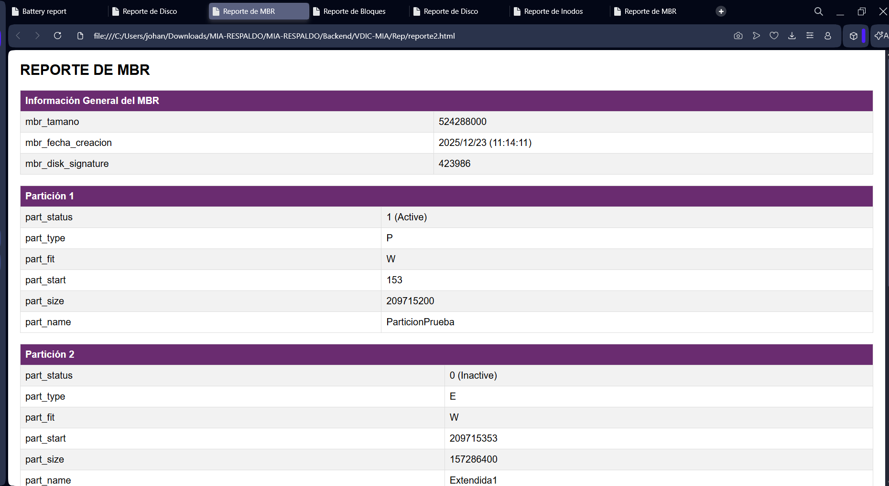

# Manual de Usuario: GoDisk/ExtreamFS
Nombre: Ashley Mishell Tubac Sitavi
Curso: manejo e implementación de archivos
Auxiliar: Juan Francisco Urbina Silva

# Introducción
Es una aplicación web multiplataforma que permite simular y administrar un sistema de archivos basado en EXT2. Está diseñada para facilitar la comprensión práctica de estructuras internas de sistemas de archivos, como discos, particiones, inodos, permisos y operaciones de administración, sin depender de hardware físico.

# Requisitos de sistema e instalación
## Requisitos mínimos
+ Navegador web moderno Chrome, Firefox o Edge

+ Node.js para desarrollo o si se ejecuta localmente

+ Go 1.19+ para el backend

## Interfaz de Usuario
La interfaz está diseñada para ser intuitiva y funcional, dividiéndose en las siguientes secciones:

* **Consola de Comandos (Panel Izquierdo):** Área para introducir manualmente los comandos.

* **Salida del Sistema (Panel Derecho):** Panel donde se visualizan los resultados, mensajes de éxito o errores generados por el servidor.

* **Barra de Herramientas:**
    * **Reportes:** Permite visualizar la estructura gráfica del sistema 
    
    
    
    
    * **Limpiar:** Vacía el historial de la salida del sistema para facilitar la lectura.

## Guía de Comandos Principales

Los comandos pueden escribirse en mayúsculas o minúsculas. Los parámetros con espacios deben encerrarse en comillas dobles " ".

###  Administración de Discos
#### `MKDISK`
Crea un archivo de disco virtual.
* **Parámetros:** -size (tamaño), -unit (K o M), -fit (BF, FF, WF).
* *Ejemplo: mkdisk -size=10 -unit=M -fit=FF

#### `RMDISK`
Elimina un disco existente.
* **Parámetros:** -driveletter (letra asignada al disco).

### Particiones y Formateo
#### FDISK
Administra particiones en un disco.
* **Parámetros:** -size, -unit, -driveletter, -name, -type (P, E, L).
* Ejemplo:fdisk -size=5 -unit=M -driveletter=A -name=Particion1

#### `MOUNT`
Monta una partición para que sea accesible.
* **Parámetros:** -driveletter, -name.

#### `MKFS`
Formatea una partición con el sistema EXT2.
* **Parámetros:** -id (ID generado al montar), -type (Full).

###  Usuarios y Grupos
Para realizar estas acciones, debe haber una sesión activa.

* **`LOGIN`**: Inicia sesión en el sistema ej. login -user=root -pass=123 -id=XX.
* **`LOGOUT`**: Cierra la sesión actual.
* **`MKGRP`**: Crea un nuevo grupo de usuarios.
* **`MKUSR`**: Crea un nuevo usuario en un grupo.

###  Carpetas y Archivos
* **`MKDIR`**: Crea una nueva carpeta, usa -p para crear carpetas padre.
* **`MKFILE`**: Crea un archivo de texto con contenido específico.
* **`CAT`**: Muestra el contenido de archivos en la consola.

## Visualización de Reportes
El sistema permite generar representaciones gráficas de la estructura interna:
1.  **Reporte de Inodos:** Muestra el estado de la tabla de inodos.
2.  **Reporte de Bloques:** Visualiza los bloques de datos y carpetas.
3.  **Reporte Tree:** Árbol completo del sistema de archivos (Inodos + Bloques).
4.  **Reporte Superblock:** Detalles técnicos de la partición formateada.

